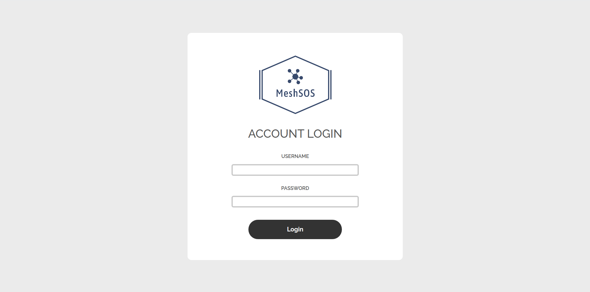
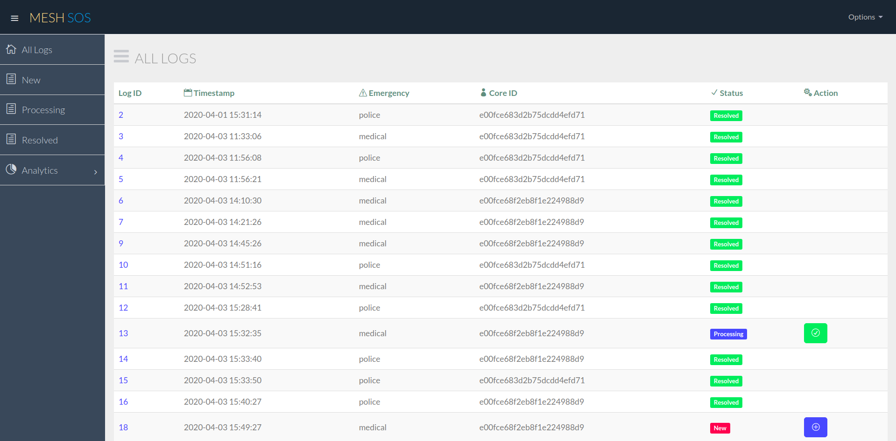
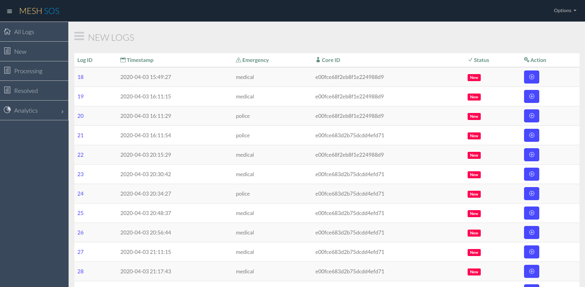
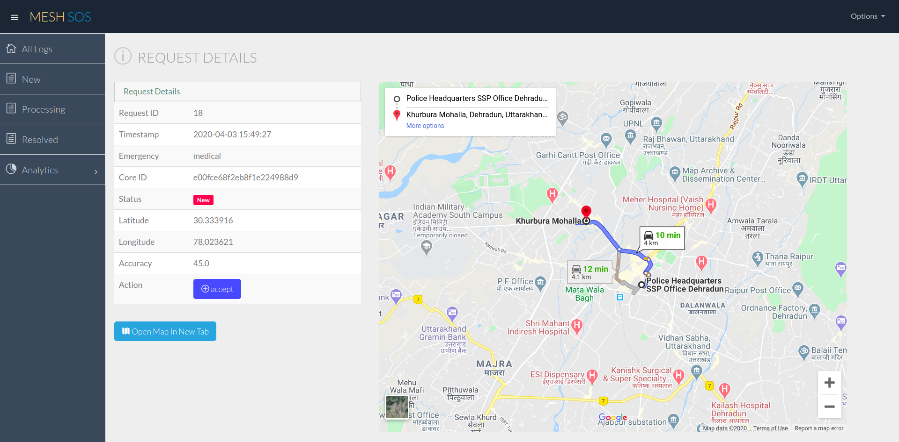
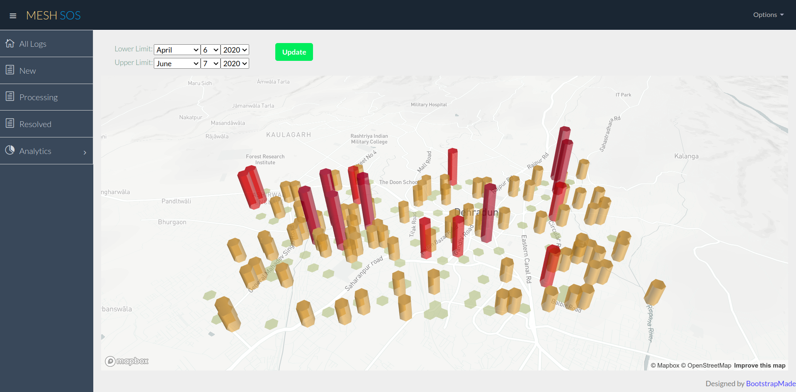
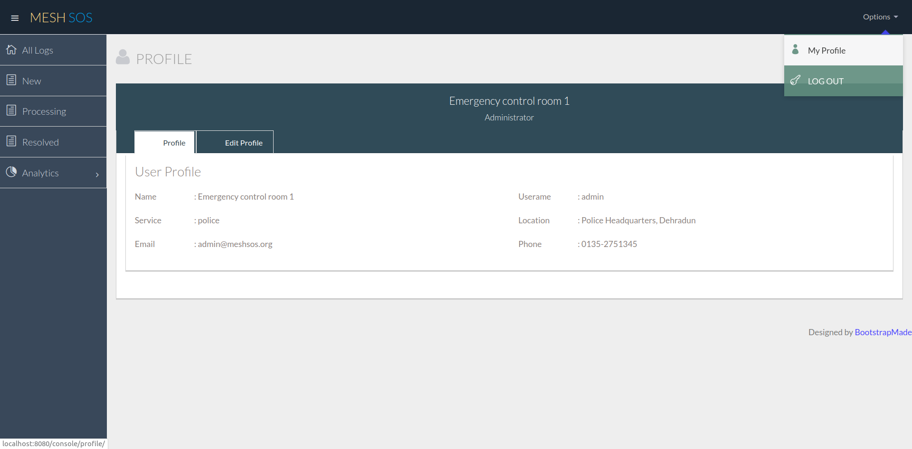

# MeshSOS Dashboard
This is an admin dashboard for the project [MeshSOS](https://github.com/bhavyejain/MeshSOS), created to be used by emergency services authorities. 
This dashboard provides a minimalistic UI and enables a simple flow of handling of emergency calls. Currently, the dashboard also provides a data visualization section,
that renders a 3D graph on maps to visualize the number of cases in the area.

 

## Features & Components

### Database
This project uses SQLite database, the default database of django.
### Styling
The dashboard is based on the [Nice Admin](https://bootstrapmade.com/nice-admin-bootstrap-admin-html-template/) theme by [Bootstrapmade](https://bootstrapmade.com/).
### Data Visualization
The data visualization section was created using [Deck.gl](https://deck.gl/#/) framework by Uber.

The deck.gl `Hexagon Layer` layer is rendered on a [Mapbox](https://www.mapbox.com/) map.

### Emergency Workflow
The details page for an emergency shows all th relevant details including the type of emergency, the time of receiving the message and location.

The best route from the emergency services centre to the caller device is shown on a Google map on the same page.

The authority can change the status of a request from the details page to move the process through the response pipeline.

### Logging
The authorities have the option to view all logs at once, or separated into categories: `New`, `Processing` & `Resolved`.

The logs pages also provide the functionality to control the flow of response and change the status of a request.

### Admin Profile
The authorities can change their profile information when required. 

If they change their location, the system updates the centre focus point of all the map-based components of the system. The origin of the
optimal route to the device will also be updated accordingly.

## Setup

1. Clone the repository `git clone https://github.com/bhavyejain/meshsos-dashboard.git` and cd into `meshsos-dashboard`
2. Create a python 3 virtual environment and activate it.
3. Install the requirements `pip install -r requirements.txt`
4. Change directory to dashboard and make migrations `python manage.py makemigrations` and then migrate `python manage.py migrate`
5. Get API keys for [Google Maps API](https://developers.google.com/maps/documentation/javascript/get-api-key) and [Mapbox](https://docs.mapbox.com/help/how-mapbox-works/access-tokens/). 
6. Create a file `api_key.txt` inside dashboard.
7. Paste your Google Maps API in `api_key.txt` first and then in a new line, paste your Mapbox API key.
8. Create a superuser from Django shell.
9. Run `python manage.py runserver 8080` to start the server.
10. Go to `http://localhost:8080/console` to view the console. 

## Screenshots

#### Login Screen:

-------------
#### All Logs:

-----------
#### New Logs:

-------------
#### Request Detail Screen:

---------------
#### Visualization Screen:

------------
#### Profile View and Edit Screen:

